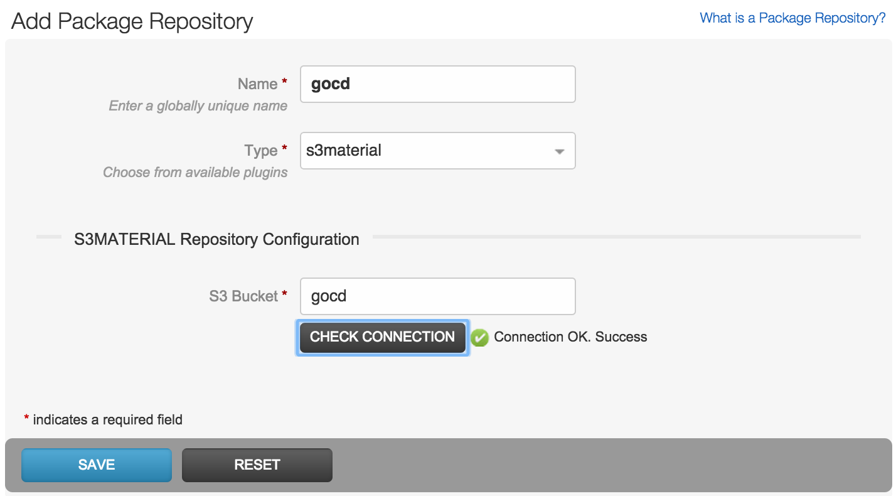
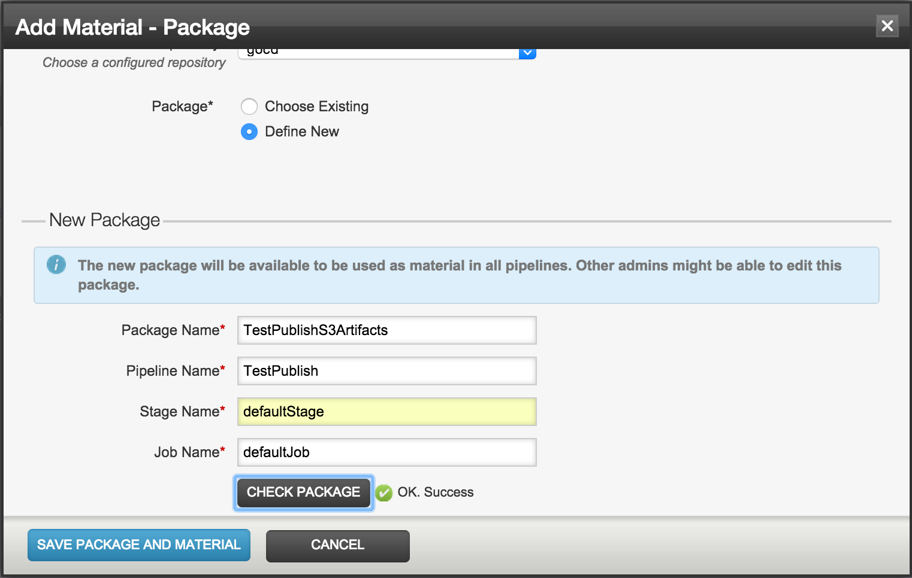
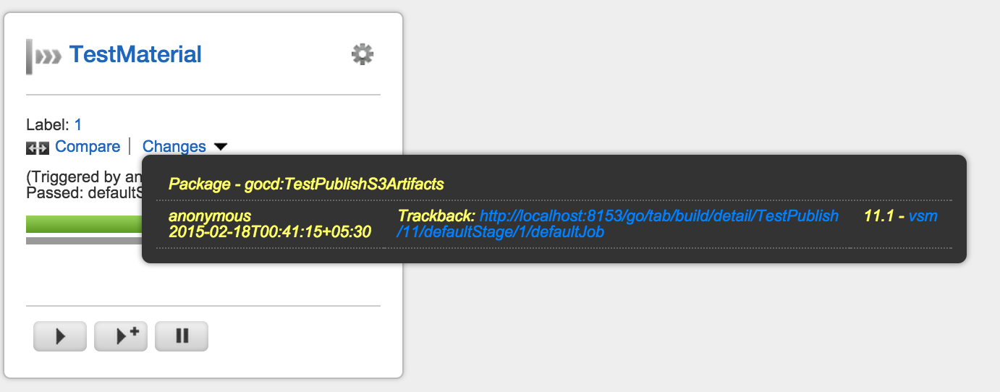

Material Poller
===

This is a package repository plugin that polls S3 for artifacts and triggers the pipeline as appropriate.

## Adding the package repository

The package repository can be configured by heading to `Admin -> Package Repositories`

In the `Add Package Repository` form, provide a name for the S3 package repository. This is a unique name to identify the S3 package repository.

Next, choose `s3material` as the `Type` of the package repository. This should bring up a text box to enter the S3 bucket name. Enter the name of the bucket where you want to store the artifacts in this field.

Use the `Check Connection` button to verify that the credentials are fine and the provided bucket exists. This state is shown in the following screenshot:

Click on `Save` to add the S3 package repository.

## Configuring as material

Once the package has been created, we can add a Package material to any pipeline. The steps for adding the package material to an existing pipeline or to a new one are the same.

Following `Materials` tab of an existing pipeline, choose `Add Material` and select `Package`. The `Add Material - Package` dialog comes up. Here, choose the Repository name (`gocd` in the example) and choose to define a new package. On doing this, the `New Package` form comes up.

Provide an identifiable name for the `Package Name`. Also configure the `Pipeline Name`, `Stage Name` and `Job Name` based on where we want to get the artifacts from.

Click on `Check Package` to ensure that we have entered the right pipeline, stage and job details, and that the artifacts exist on S3.

This state is shown in the following screenshot:

Click on `Save Package And Material` button to save the new package and material.

Note that the saved package can be reused in other jobs/pipelines.

## Trackback and artifact information

Once the material is added, it will poll for new artifacts on S3. If found, a new run of the pipeline will be triggered. The Trackback URL will point to the source of the artifacts, as shown in the following screenshot:

