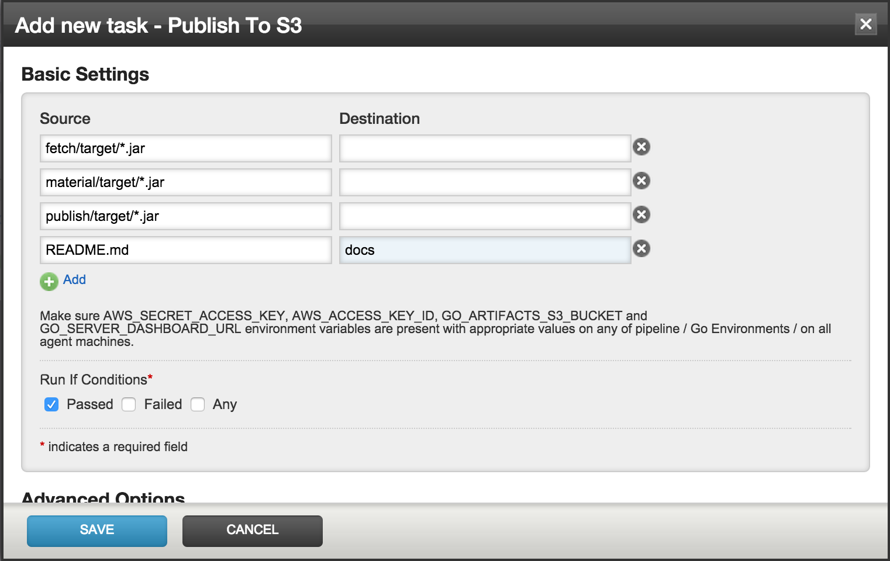

Publish
===

The `Publish to S3` task plugin (indix.s3publish) is used to upload artifacts to S3.

Once the plugin is installed, it should be available as a task, ready to be added into any of your jobs. From the admin section of the concerned job, click on the `Add new task` link and choose `Publish To S3` as the task, as shown in the following screenshot:

The resulting dialog for the task is shown in the following screenshot:

The interface is pretty similar to the Artifacts configuration in Go. Clicking on the `Add` link adds text boxes where source and destination paths for artifacts can be provided. This is shown in the following example screenshot:

The artifacts get uploaded to the S3 path `s3://<GO_ARTIFACTS_S3_BUCKET>/<PIPELINE_NAME>/<STAGE_NAME>/<JOB_NAME>/<PIPELINE_COUNTER>.<STAGE_COUNTER>` as the root path.

For example, if the pipeline name is `TestPublish`, and the stage and job names are `defaultStage` and `defaultJob` respectively, the root path for the artifacts for the eight run of the pipeline and the first run of `defaultStage` will be `s3://gocd/TestPublish/defaultStage/defaultJob/8.1/`. `gocd` here is the name of the bucket for storing artifacts.

As per the screenshot, the jar files in `fetch/target`, `material/target` and `publish/target` will be uploaded to the root of the artifacts. The `README.md` file will be uploaded unders the `docs` folder.

After adding the necessary artifacts, click on `Save` to add the task to the job.
